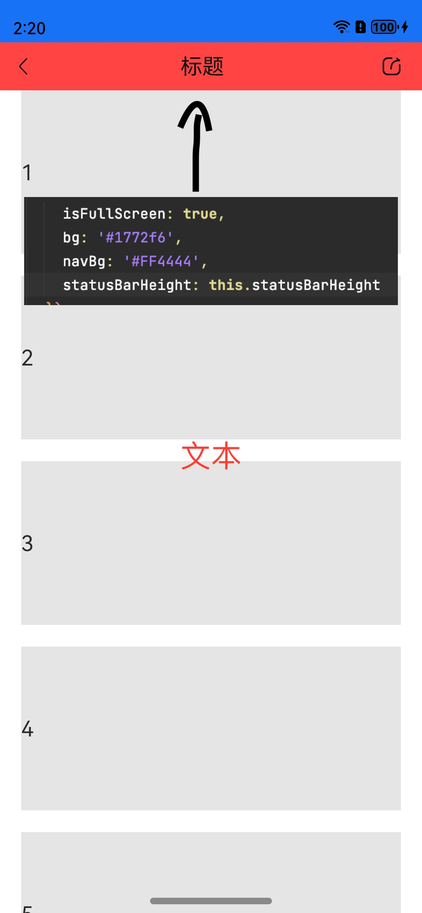
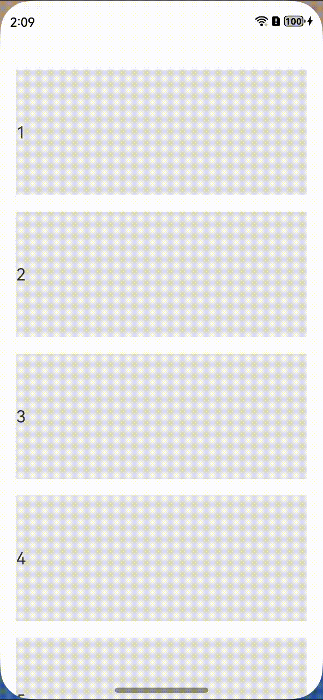
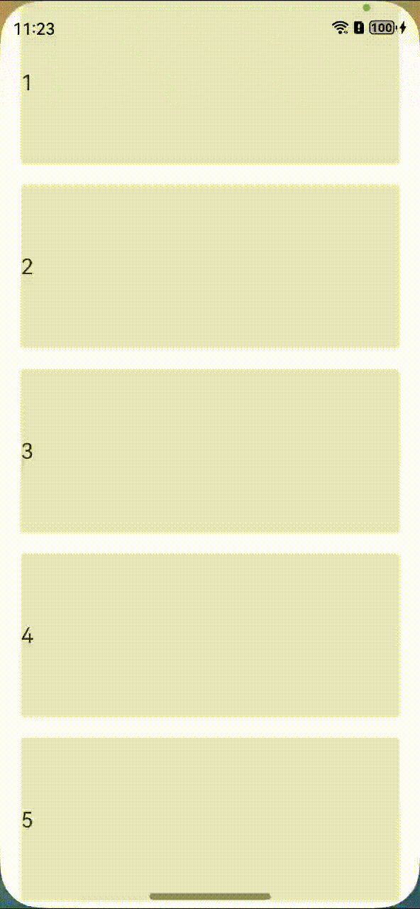

# 鸿蒙通用库

## Head组件
   ```
    isFullScreen: true, // 是否全屏,全屏要设置安全局,即statusBarHeight
    statusBarHeight: xxx // 状态栏高度
    alpha: this.alpha, // 透明色值，可以动态设置
    alphaType: 'bg', // 透明的方式，bg是背景色，whole是整体的opacity
    bg: '#1772f6', // 背景色
    navBg: '#FF4444', // 导航栏背景色
    placeHolder: false,// 是否占位
   ```

1. 占位/不占位，透明

   
   
    


